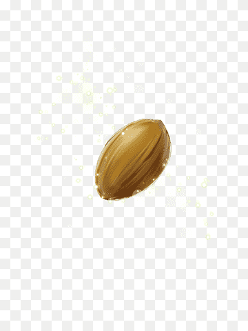
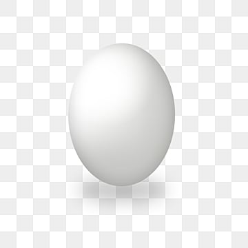
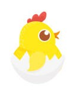

 # BİRD WATCH
 
 BİRD WATCH OYUN VİDEOSUNUN YOUTUBE LİNKİ :
 [Oyun Videosu](https://www.youtube.com/watch?v=AxUuG2Yco5E)

# OYUNDAN GÖRSELLER 
 

  

 # KULLANILAN TEKNOLOJİLER
 HTML5 ve Javascript ile canvas kullanılarak oluşturulmuştur.
 
 # OYUN KURALLARI 
 Her oyunda 20 tur vardır ve satranç tahtası içindeki kuşlar kenarda kırılan yumurtalardan kaçmaya çalışırlar.
 Satranç taşı ile hareket eden kuşlar her turun sonunda satranç tahtasının etrafında kırılan yumurtalardan kaçmaya çalışırlar.
 En az skor yapmaya çalışılır.Yani kırılan yumurtalardan kaçmaya çalışılır.

 # OYUNUN İNTERNET SİTESİ LİNKİ
 OYUNUN LİNKİ:(https://lunar-wire.itch.io/birdwatch)

 # KAYNAKLAR 
 Projede kullanılan görseller ve sesler internetten ücretsiz ve telifsiz kaynaklardan indirilmiştir.  

  
  
  
  

[Arka Plan Müziği](sesler/arka-plan.mp3)  
[Tıklama Sesi](sesler/tik.mp3)

 

 

 

